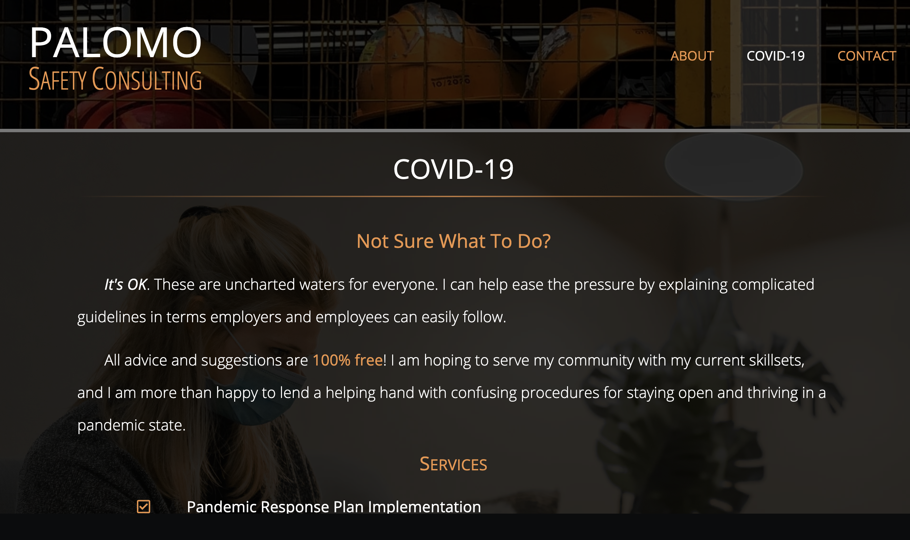

# Palomo Safety Consulting (Built by Michael Hanson)

## Deployed Application 

[Palomo Safety Consulting - Michael Hanson](https://palomo-safety-consulting.herokuapp.com/)

## Features

* Built using React and utilizing React components
* React Router used to serve pages
* Bootstrap 4 components including grid, navbar, cards, and modals 
* Responsive to a wide variety of screen sizes using Bootstrap and supporting Media Queries

## Contact

Michael Hanson
* michaeledwardhanson@gmail.com
* [GitHub](https://github.com/mhans003)
* [LinkedIn](https://www.linkedin.com/in/michaeledwardhanson/)

## License

Licensed under the [MIT License](./LICENSE.txt).